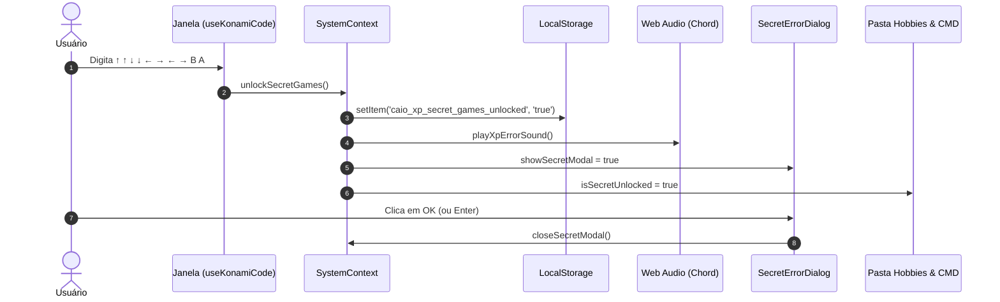

# Design Doc: Konami Code Easter Egg & Jogos Secretos (Minecraft & GTA)

## 1. Visão Geral

Implementar um Easter Egg retro clássico utilizando o **Konami Code** (`↑ ↑ ↓ ↓ ← → ← → B A`) no portfólio Windows XP.
Por padrão, os jogos pesados/customizados adicionados aos hobbies (**Minecraft Classic** e **GTA Vice City**) ficam ocultos na pasta de Hobbies e no Prompt de Comando (CMD).
Ao digitar a sequência Konami em qualquer parte do sistema:
1. Uma janela autêntica de diálogo do Windows XP surge com o som característico de alerta/erro do sistema e o título **"Easter Egg do Sistema"**.
2. A mensagem exibe: *"Código secreto ativo! Jogos liberados (Minecraft e GTA)"*.
3. O estado é salvo de forma persistente no `localStorage` (`caio_xp_secret_games_unlocked`).
4. A pasta **Hobbies** (`hobbies-window`) passa a exibir `Minecraft.exe` e `GTA_Vice_City.exe`.
5. O **Prompt de Comando (CMD)** passa a listar os comandos `MINECRAFT` e `GTA / VICECITY` no `help`, e permite executá-los diretamente.
6. Um comando `lock` no CMD permite bloquear os jogos novamente para facilitar testes e demonstrações.
7. Jogos nativos padrão do Windows XP (**Campo Minado** e **Paciência Spider**) permanecem sempre visíveis e desbloqueados.

---

## 2. Arquitetura e Componentes

### 2.1 Hook Global `useKonamiCode`
- **Arquivo:** `src/hooks/useKonamiCode.ts`
- **Responsabilidade:** Escutar eventos de `keydown` no objeto `window` e armazenar o histórico das últimas 10 teclas.
- **Sequência:**
  `['ArrowUp', 'ArrowUp', 'ArrowDown', 'ArrowDown', 'ArrowLeft', 'ArrowRight', 'ArrowLeft', 'ArrowRight', 'b', 'a']` (case-insensitive).
- **Callback:** `onSuccess: () => void`.

### 2.2 Gerenciamento de Estado no `SystemContext`
- **Arquivo:** `src/context/SystemContext.tsx`
- **Novo Estado:**
  - `isSecretUnlocked: boolean` (inicializado com `localStorage.getItem('caio_xp_secret_games_unlocked') === 'true'`).
  - `showSecretModal: boolean` (indica se a janela do Easter Egg está aberta no momento).
- **Métodos:**
  - `unlockSecretGames(): void`: atualiza `isSecretUnlocked` para `true`, salva `'true'` no `localStorage`, toca o efeito sonoro e ativa `showSecretModal = true`.
  - `lockSecretGames(): void`: atualiza `isSecretUnlocked` para `false`, remove ou grava `'false'` no `localStorage`, e fecha `showSecretModal`.
  - `closeSecretModal(): void`: fecha o modal visual.

### 2.3 Componente Visual `SecretErrorDialog`
- **Arquivo:** `src/components/modals/SecretErrorDialog.tsx`
- **Estilo:** Diálogo clássico modal do Windows XP.
  - Barra superior em gradiente azul (`#0058EE` para `#032598`), texto branco e botão `X`.
  - Título: `Easter Egg do Sistema`.
  - Corpo da janela em cinza XP (`#ECE9D8`) com bordas em relevo clássico.
  - Ícone: Círculo vermelho com "X" branco (`Critical Error / System Alert`).
  - Mensagem textual: `"Código secreto ativo! Jogos liberados (Minecraft e GTA)"`.
  - Botão `"OK"` centralizado/alinhado com estilo clássico e foco inicial para fechar ao pressionar Enter/Espaço.

### 2.4 Efeito Sonoro (*Windows XP Chord / Critical Error*)
- **Arquivo:** `src/utils/audioEffects.ts`
- **Responsabilidade:** Tocar o acorde de erro do Windows XP utilizando síntese pura via Web Audio API (`AudioContext`) para máxima fidelidade e zero dependência de arquivos externos que possam falhar no carregamento.

### 2.5 Filtragem na Pasta Hobbies
- **Arquivo:** `src/components/windows/ExplorerFolderApp.tsx`
- **Lógica:**
  - Consome `isSecretUnlocked` do `SystemContext`.
  - Filtra os itens exibidos da pasta `hobbies`:
    - Se `isSecretUnlocked === false`: remove itens com IDs `'minecraft'` e `'vice-city'`.
    - Se `isSecretUnlocked === true`: exibe todos os itens de `HOBBIES_ITEMS`.
  - Contagem de itens na barra de status e seleção do primeiro item acompanham a lista filtrada.

### 2.6 Integração no Prompt de Comando (CMD)
- **Arquivo:** `src/utils/cmdEngine.ts`
- **Assinatura do `CommandContext`:**
  - `isSecretUnlocked?: boolean`
  - `lockSecretGames?: () => void`
  - `unlockSecretGames?: () => void`
- **Comportamento do `help`:**
  - Se `isSecretUnlocked === false`: omite `MINECRAFT` e `GTA / VICECITY`.
  - Se `isSecretUnlocked === true`: exibe os dois comandos normalmente.
- **Execução dos comandos `minecraft`, `mc`, `gta`, `vicecity`:**
  - Se bloqueado: exibe a mensagem de comando não reconhecido.
  - Se desbloqueado: abre a respectiva janela do jogo.
- **Comando `lock` / `resetgames`:**
  - Executa `ctx.lockSecretGames?.()`.
  - Retorna mensagem confirmando que os jogos secretos foram bloqueados novamente.

---

## 3. Fluxo de Dados e Ciclo de Vida

---

## 4. Testes e Critérios de Aceite

1. **`src/test/useKonamiCode.test.ts`:**
   - Detecta sequência completa e dispara callback.
   - Reseta em tecla incorreta.
2. **`src/test/SecretErrorDialog.test.tsx`:**
   - Renderiza título, ícone, texto e botão OK.
   - Fecha ao clicar em OK.
3. **`src/test/cmdEngine.test.ts`:**
   - `help` omite comandos secretos se bloqueado.
   - `gta` e `minecraft` retornam comando não reconhecido se bloqueado.
   - `lock` bloqueia e exibe mensagem informativa.
   - Comandos funcionam após desbloqueio.
4. **`src/test/ExplorerFolderApp.test.tsx`:**
   - Valida que `Minecraft.exe` e `GTA_Vice_City.exe` não aparecem se bloqueado, e aparecem após desbloqueio.
